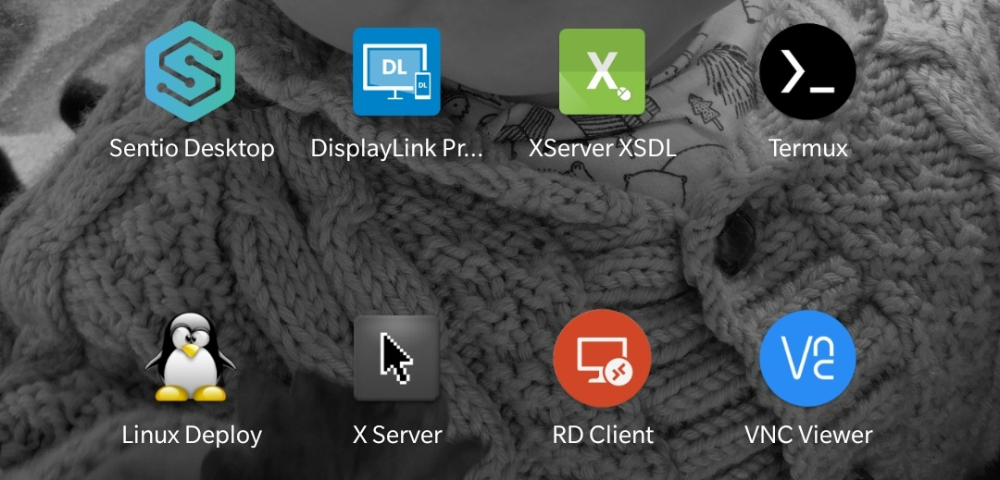
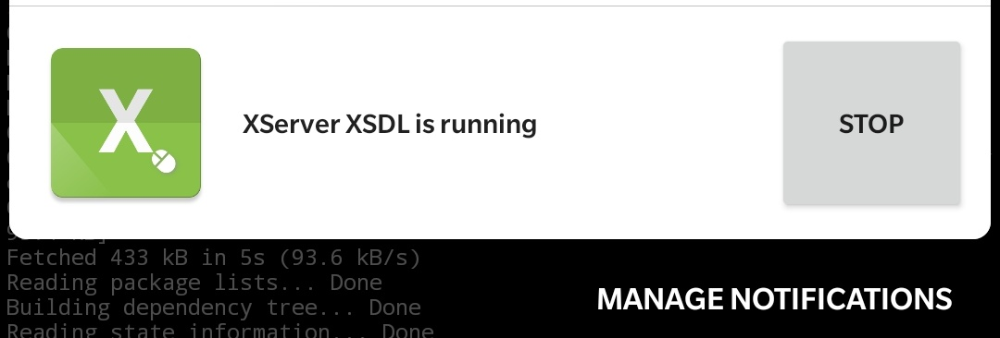

# Termux, XSDL (wmaker)

_Termux and XSDL apps needed_

## Install

_window managers_ : `wmaker` <3, `dwm`, `twm`, `fvwm`

```bash
apt update && apt install wmaker -y
```

## Scenario

- run the app : `XSDL`




- set display : `export DISPLAY=:0`
- run the window manager : `wmaker &`

